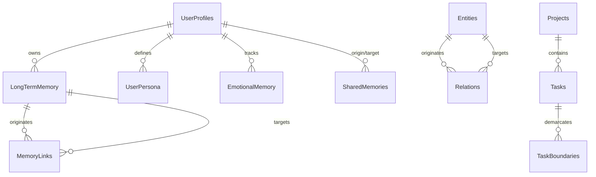
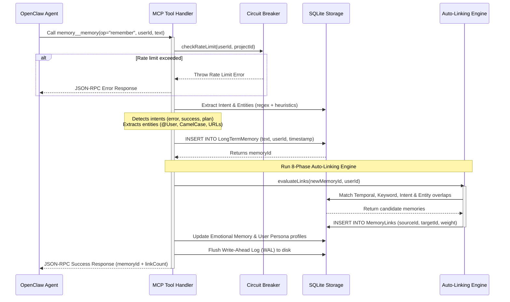
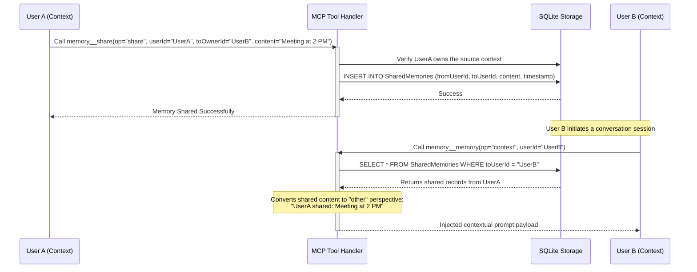

# System Architecture - Graph-Based Multi-User Memory MCP

This document details the architectural design, database schemas, execution flows, and integration protocols of the **Memory MCP Server**.

---

## 1. System Topology & Storage Engine

The Memory MCP server is built on a single-process Node.js runtime, executing over the Model Context Protocol (MCP) using a standard stdio/JSON-RPC transport. All state is persisted within a highly structured relational SQLite database designed to simulate a perspective-oriented knowledge graph.

### Core Architectural Layers:
1. **Model Context Protocol (MCP) Interface**: Handles JSON-RPC protocol messages (`ListToolsRequestSchema`, `CallToolRequestSchema`, `GetPromptRequestSchema`) and delegates them to specific tool handlers.
2. **Enterprise Resilience & Security Tier**:
   - **Circuit Breaker**: Enforces client/project-level execution rate limits.
   - **Output Sanitizer**: Prevents context-window poisoning by restricting database dump sizes.
   - **Audit Logger**: Cryptographically tracks execute latencies, arguments, and outcomes.
3. **Memory Storage Engine**: Orchestrates graph traversals, entity linkages, short-term KV store caching, emotional weights, and persona characteristics.
4. **Relational SQLite Database Layer**: Executes transactional logic, index updates, and triggers Write-Ahead Logging (WAL) flushes to disk.

---

## 2. Relational Schema & Database Structure

The underlying SQLite schema maintains multiple specialized tables to manage context, graph entities, timelines, and multi-user configurations.

### Table Definitions & Roles:
- **`UserProfiles`**: Houses user configurations, client groups, and identity variables.
- **`LongTermMemory`**: Persists consolidated textual memories, import timestamps, boosting metrics, and decay variables.
- **`MemoryLinks`**: Junction table maintaining bidirectional edges between individual memories (auto-linked across sessions).
- **`Entities`**: Persists knowledge graph nodes (e.g., `Person`, `Bot`, `Organization`, `Task`, `Rule`).
- **`Relations`**: Connects entities through typed graph relationships (e.g., `DEPENDS_ON`, `SUBTASK_OF`, `OWNS`, `KNOWS`).
- **`ShortTermMemory`**: In-memory caching layer for active session contexts.
- **`WorkingBuffer` & `ShortTermChat`**: Temporarily stores active convo transcripts to run real-time contextual abstractions.
- **`UserPersona`, `EmotionalMemory`, `LearningLog`**: Tracks behavioral preferences, user emotional intensity, and adaptive client habits.
- **`SharedMemories`**: Direct mapping of memories shared between different user perspectives (`self` vs `other`).

---

## 3. Core Execution Flow Diagrams

### Flow 1: Memory Ingestion & Auto-Linking Lifecycle

This diagram shows the complete sequence from the moment the agent registers a user's statement via `memory__memory(op="remember")` to database serialization.

---

### Flow 2: Multi-User Memory Sharing & Perspective Resolution

This diagram illustrates how User A shares information with User B, converting the memory from a `self` perspective to an `other` perspective.

---

## 4. Key Subsystem Logic & Algorithms

### The 8-Phase Auto-Linking System
When a memory is written, it is linked to existing memories through a tiered evaluation model:
1. **Temporal Clustering (Phase 0)**: Links memories created within the same active session window.
2. **Entity Overlap (Phase 1)**: Links memories referencing the exact same knowledge graph entities.
3. **Project Association (Phase 2)**: Groups memories belonging to the same project context.
4. **Intent Correlation (Phase 3)**: Matches identical cognitive intents (e.g., matching a reported "bug" memory to an older "error" logs memory).
5. **Keyword/Semantic Match (Phase 4)**: Computes text overlap and tags associations.
6. **Cross-Project Linkage (Phase 5)**: Intersects related tasks from separate project domains.
7. **Temporal Chaining (Phase 6)**: Connects records across adjacent conversation boundaries (30-min window).
8. **Entity Graph Traversal (Phase 7)**: Traverses relations (`DEPENDS_ON`, `OWNS`) to build second-degree link paths.

### Intent Detection Weights
Intents are evaluated using exact regex patterns:
- **`error`**: Triggered by keywords `fail`, `crash`, `bug`, `exception`, `error`, `unhandled`. Weight: `80%`.
- **`success`**: Triggered by keywords `fixed`, `resolved`, `completed`, `done`, `passed`. Weight: `70%`.
- **`learning`**: Triggered by keywords `learned`, `discovered`, `insight`, `realized`. Weight: `80%`.
- **`planning`**: Triggered by keywords `todo`, `will`, `going to`, `plan`, `schedule`. Weight: `50%`.

---

## 5. Resilience & High Availability Protocols

- **Circuit Breaker System**: Protects the SQLite storage engine from denial-of-service attempts by throttling queries if a single client triggers more than `100` calls per minute.
- **Output Sanitization**: Large database dumps retrieved during search/recall operations are intercepted and truncated if the character size exceeds `process.env.MAX_OUTPUT_SIZE || 500000` to prevent context window overflows in the LLM.
- **Graceful Termination Hooks**: Intercepts `SIGINT` and `SIGTERM` signals to allow the SQLite database engine to flush all transaction journals, sync Write-Ahead Logs (WAL), and close connection descriptors cleanly.
