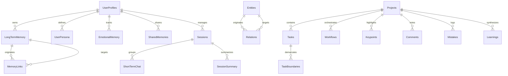
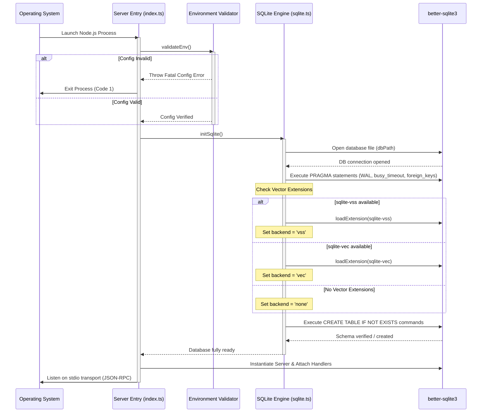
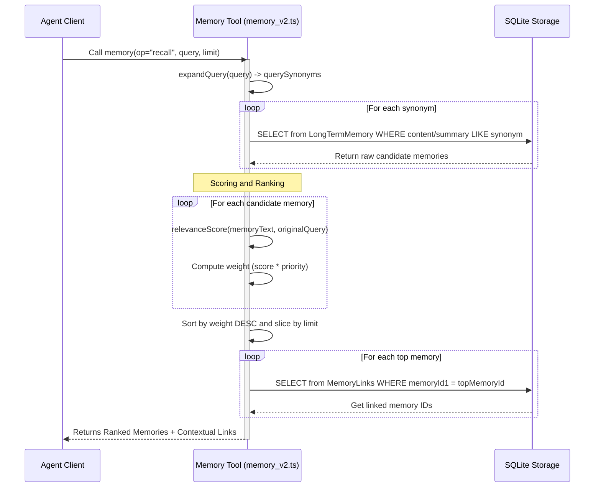
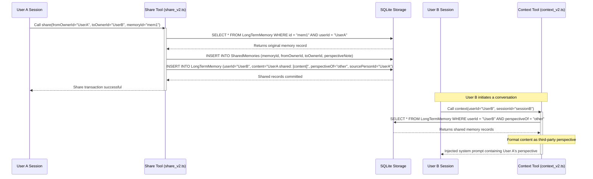
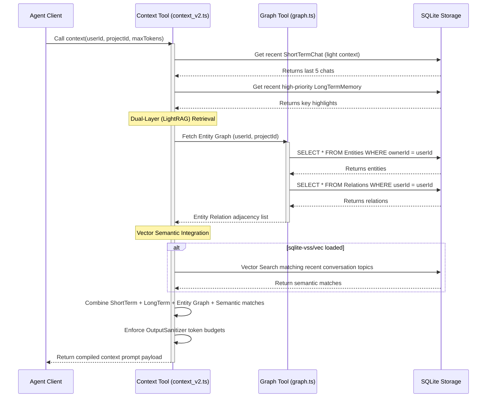
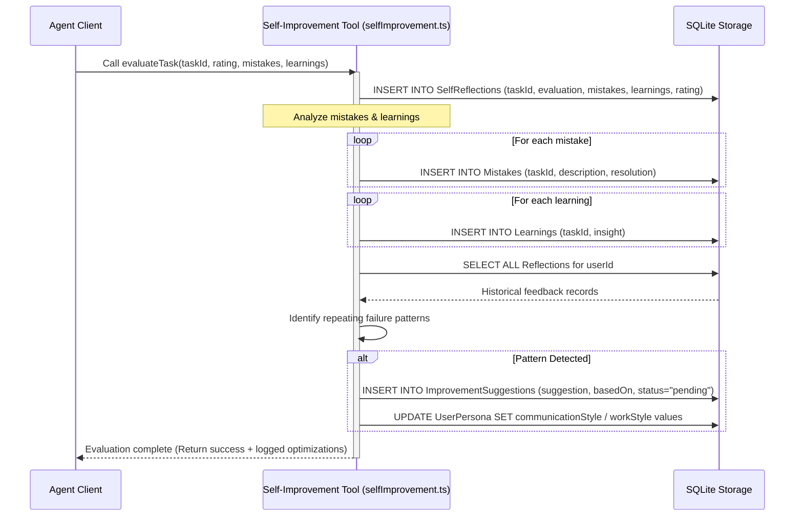

# System Architecture - Graph-Based Multi-User Memory MCP

This document details the architectural design, database schemas, execution flows, and integration protocols of the **Memory MCP Server**.

---

## 1. System Topology & Storage Engine

The Memory MCP server is built on a single-process Node.js runtime, executing over the Model Context Protocol (MCP) using a standard stdio/JSON-RPC transport. All state is persisted within a highly structured relational SQLite database designed to simulate a perspective-oriented knowledge graph.

### Core Architectural Layers:
1. **Model Context Protocol (MCP) Interface**: Handles JSON-RPC protocol messages (`ListToolsRequestSchema`, `CallToolRequestSchema`, `GetPromptRequestSchema`) and delegates them to specific tool handlers.
2. **Enterprise Resilience & Security Tier**:
   - **Circuit Breaker**: Enforces client/project-level execution rate limits.
   - **Output Sanitizer**: Prevents context-window poisoning by restricting database dump sizes.
   - **Audit Logger**: Cryptographically tracks execution latencies, arguments, and outcomes.
3. **Memory Storage Engine**: Orchestrates graph traversals, entity linkages, short-term KV store caching, emotional weights, and persona characteristics.
4. **Relational SQLite Database Layer**: Executes transactional logic, index updates, and triggers Write-Ahead Logging (WAL) flushes to disk. It also dynamically loads sqlite-vss or sqlite-vec for vector similarity search when available.

---

## 2. Relational Schema & Database Structure

The underlying SQLite schema maintains multiple specialized tables to manage context, graph entities, timelines, and multi-user configurations.

### Table Definitions & Roles:

#### 1. Core Profile & State Tables
* **`UserProfiles`**: Houses user configurations, client groups, and interaction characteristics (e.g. message length, emoji usage, urgency indicators, and isHindi flags).
* **`UserPersona`**: Defines specific user traits, preferred communication style, work style, quirks, reminders, and historical mood logs.
* **`EmotionalMemory`**: Tracks user emotional state (mood, triggers, context, and intensity) linked to specific sessions and memories.
* **`LearningLog`**: Tracks adaptive learning patterns, confidence ratings, and pattern usage counts to adjust assistant interaction strategies.

#### 2. Episodic & Semantic Memory Tables
* **`LongTermMemory`**: Persists consolidated textual memories, summaries, priority scores, access counters, tags, and parent summary IDs for incremental consolidation.
* **`MemoryLinks`**: Junction table maintaining bidirectional edges and association strengths between individual long-term memories.
* **`ShortTermMemory`**: In-memory key-value caching layer for fast active-session context updates.
* **`ShortTermChat`**: Temporarily stores active conversation logs, priorities, and referenced entities before rolling them up into long-term memories.
* **`SessionSummary`**: Contains incremental, compressed summaries of conversation sessions.
* **`ConversationMemory` & `RawInteraction`**: Caches compressed and raw fallback conversation transcripts for historical reference.
* **`MemoryIndex`**: Serves as a fast keyword/entity inverted index for quick retrieval.

#### 3. Knowledge Graph Tables
* **`Entities`**: Persists knowledge graph nodes representing actors, systems, tools, or concepts (e.g. `Person`, `Bot`, `Organization`, `Task`, `Rule`).
* **`Relations`**: Connects entities through typed graph relationships (e.g., `DEPENDS_ON`, `SUBTASK_OF`, `OWNS`, `KNOWS`).
* **`SharedMemories`**: Maps memories shared between different user perspectives (`self` vs `other`), enabling perspective-oriented resolution.
* **`Topics` & `Sessions` & `Timeline`**: Manages logical categorization, active conversation threads, and chronological timeline entries.

#### 4. Project & Task Management Tables
* **`Projects`**: Defines high-level project domains.
* **`Tasks` & `TaskBoundaries`**: Tracks task states, priorities, sub-todos, and operational boundaries.
* **`Workflows`**: Sequences step-by-step procedures associated with specific projects.
* **`Keypoints` & `Comments`**: Stores bulleted highlights and discussions related to tasks.
* **`Mistakes` & `Learnings`**: Logs development errors and insights to prevent regressions.

---

## 3. Core Execution Flow Diagrams

### Flow 1: Server Initialization & Boot Sequence
This diagram details the sequence of checks, database initialization, dynamic vector module loading, and WAL initialization.

---

### Flow 2: Memory Ingestion & Auto-Linking Lifecycle
This sequence tracks the 8-phase linking and memory evolution process triggered by storing a message.

```mermaid
sequenceDiagram
    participant Agent as Agent Client
    participant Handler as Tool Handler (mcp.ts)
    participant CB as Circuit Breaker
    participant MemTool as Memory Tool (memory_v2.ts)
    participant DB as SQLite Storage
    
    Agent->>Handler: Call memory(op="remember", userMessage, agentMessage)
    activate Handler
    Handler->>CB: checkRateLimit(userId, projectId)
    alt Rate Limit Exceeded
        CB-->>Handler: Throw Limit Error
        Handler-->>Agent: JSON-RPC Error (Rate Limited)
    end
    
    Handler->>MemTool: remember(userId, projectId, userMessage, agentMessage)
    activate MemTool
    
    Note over MemTool: Intent Detection & Entity Extraction
    MemTool->>MemTool: detectIntent(text) -> intentType
    MemTool->>MemTool: extractEntities(text) -> entityList
    MemTool->>MemTool: extractKeywords(text) -> keywordList
    MemTool->>MemTool: autoSummarize(text) -> summary
    
    MemTool->>DB: INSERT INTO LongTermMemory (content, summary, intent, entities, keywords, priority)
    DB-->>MemTool: Returns memoryId
    
    Note over MemTool: Execute 8-Phase Auto-Linking Engine
    rect rgb(30, 41, 59)
        MemTool->>DB: Phase 0: Temporal - Get most recent memory
        DB-->>MemTool: Link with strength 0.9
        
        MemTool->>DB: Phase 1: Entity Match - Find matching entities
        DB-->>MemTool: Link with strength 0.8
        
        MemTool->>DB: Phase 2: Intent Cluster - Group active intents
        DB-->>MemTool: Link with strength 0.6
        
        MemTool->>DB: Phase 3: Project Match - Bind to project context
        DB-->>MemTool: Link with strength 0.7
        
        MemTool->>DB: Phase 4: Keyword Match - Find similar keywords
        DB-->>MemTool: Link with strength 0.4
        
        MemTool->>DB: Phase 5: Cross-Project - Find cross-project entity matches
        DB-->>MemTool: Link with strength 0.6
        
        MemTool->>DB: Phase 6: Temporal Chain - Check 30-min window
        DB-->>MemTool: Link with strength (0.95 - decay)
        
        MemTool->>DB: Phase 7: Entity Graph - Shared knowledge nodes
        DB-->>MemTool: Link with strength 0.75
    end
    
    MemTool->>DB: INSERT INTO MemoryLinks (memoryId1, memoryId2, relationship, strength)
    
    Note over MemTool: Phase 8 & 9: Adaptive Boost & Evolution
    MemTool->>DB: Update priorities of linked memories
    MemTool->>DB: evolveExistingMemories(merge entities & keywords)
    
    MemTool->>DB: updateUserProfile(update count, intent metrics)
    
    MemTool-->>Handler: Return Ingestion Analytics JSON
    deactivate MemTool
    Handler-->>Agent: JSON-RPC Success Response
    deactivate Handler
```

---

### Flow 3: Smart Retrieval / Recall & Query Expansion Flow
Details the retrieval pipeline matching keywords, querying synonyms, scoring, and output formatting.

---

### Flow 4: Perspective-Oriented Multi-User Memory Sharing Logic
Illustrates the perspective conversion process when User A shares context with User B.

---

### Flow 5: Context Aggregation & Dual-Layer Retrieval
This diagram visualizes how context is built using LightRAG hybrid principles (Vector similarity + Entity Knowledge Graph).

---

### Flow 6: Self-Improvement & Adaptive Learning Loop
Tracks how the agent evaluates performance, extracts lessons, and updates preferences.

---

## 4. Key Subsystem Logic & Algorithms

### The 8-Phase Auto-Linking System
When a memory is written, it is linked to existing memories through a tiered evaluation model:
1. **Temporal Clustering (Phase 0)**: Links memories created within the same active session window.
2. **Entity Overlap (Phase 1)**: Links memories referencing the exact same knowledge graph entities.
3. **Project Association (Phase 2)**: Groups memories belonging to the same project context.
4. **Intent Correlation (Phase 3)**: Matches identical cognitive intents (e.g., matching a reported "bug" memory to an older "error" logs memory).
5. **Keyword/Semantic Match (Phase 4)**: Computes text overlap and tags associations.
6. **Cross-Project Linkage (Phase 5)**: Intersects related tasks from separate project domains.
7. **Temporal Chaining (Phase 6)**: Connects records across adjacent conversation boundaries (30-min window).
8. **Entity Graph Traversal (Phase 7)**: Traverses relations (`DEPENDS_ON`, `OWNS`) to build second-degree link paths.

### Intent Detection Weights
Intents are evaluated using exact regex patterns:
- **`error`**: Triggered by keywords `fail`, `crash`, `bug`, `exception`, `error`, `unhandled`. Weight: `80%`.
- **`success`**: Triggered by keywords `fixed`, `resolved`, `completed`, `done`, `passed`. Weight: `70%`.
- **`learning`**: Triggered by keywords `learned`, `discovered`, `insight`, `realized`. Weight: `80%`.
- **`planning`**: Triggered by keywords `todo`, `will`, `going to`, `plan`, `schedule`. Weight: `50%`.

### Synonyms and Query Expansion
To resolve vocabulary mismatches, terms are mapped to synonyms before execution:
- `error` $\rightarrow$ `["fail", "bug", "crash", "exception", "broken"]`
- `success` $\rightarrow$ `["done", "completed", "fixed", "resolved"]`
- `learning` $\rightarrow$ `["discovered", "realized", "insight", "understood"]`

---

## 5. Resilience & High Availability Protocols

- **Circuit Breaker System**: Protects the SQLite storage engine from denial-of-service attempts by throttling queries if a single client triggers more than `100` calls per minute.
- **Output Sanitization**: Large database dumps retrieved during search/recall operations are intercepted and truncated if the character size exceeds `process.env.MAX_OUTPUT_SIZE || 500000` to prevent context window overflows in the LLM.
- **Graceful Termination Hooks**: Intercepts `SIGINT` and `SIGTERM` signals to allow the SQLite database engine to flush all transaction journals, sync Write-Ahead Logs (WAL), and close connection descriptors cleanly.
- **Fail-safe Dynamic Loading**: If native vector dependencies fail to load, database initializations automatically default to keyword-matching mode without halting server runtime.
